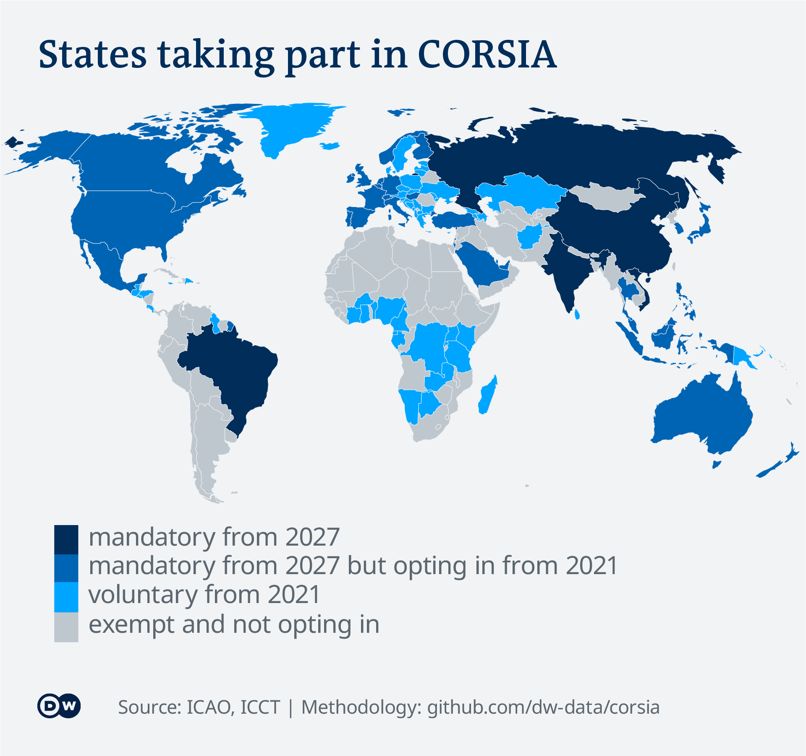

# CORSIA: world&#39;s biggest plan to make flying green &#39;too broken to fix&#39;

CORSIA – the UN-brokered "Carbon Offsetting and Reduction Scheme for International Aviation" went into effect at the start of 2021. This DW analysis shows that the deal will not require airlines to offset flight emissions for another six years and will cost them less than 1% of operating costs by 2035.

Starting in 2021, airlines will have to offset any emissions beyond 2019 levels on routes between two states that participate in CORSIA. The deal is supposed to support airlines&#39; global goal to achieve &quot;carbon-neutral growth&quot;. This analysis explores how this idea works in practice: What share of emissions is covered under CORSIA, how much will actually have to be offset over the duration of the program, and how much airlines will have to pay for those offsets.

_In this repository, you will find the methodology, data and code behind the stories that came out of this analysis._

**Read the full story:** [English](https://p.dw.com/p/3kXLJ)

**Data analysis by:** [Kira Schacht](https://twitter.com/daten_drang)

**Reporting by:** [Ajit Niranjan](https://twitter.com/NiranjanAjit),[Kira Schacht](https://twitter.com/daten_drang)

# Files

The file `CORSIA data 20200121.xlsx` contains the data sheets behind this analysis.

# Sources

For a detailed list of data sources used, also refer to the Excel file mentioned above.

| **Data** | **Source** | **Link** |
| --- | --- | --- |
| CO2 emissions &amp; total operating costs 2004-2021 | IATA | [Industry Statistics Fact Sheet November 2020](https://www.iata.org/en/iata-repository/pressroom/fact-sheets/industry-statistics/) [Economic Performance of the Airline Industry: Industry ForecastDecember 2015](https://www.iata.org/en/iata-repository/publications/economic-reports/airline-industry-economic-performance---2015-end-year---tables/) |
| CORSIA emissions projections 2010-2035 | ICCT | analysis for DW |
| CORSIA coverage shares | ICCT | May 2020: [COVID-19&#39;s big impact on ICAO&#39;s CORSIA baseline](https://theicct.org/blog/staff/covid-19-impact-icao-corsia-baseline) |
| CORSIA Participating countries Pilot phase &amp; Phase 1 | ICAO | [CORSIA States for Chapter 3 State Pairs](https://www.icao.int/environmental-protection/CORSIA/Pages/state-pairs.aspx), first edition |
| CORSIA Participating countries Phase 2 | ICCT | May 2020: [COVID-19&#39;s big impact on ICAO&#39;s CORSIA baseline](https://theicct.org/blog/staff/covid-19-impact-icao-corsia-baseline) |
| CORSIA Carbon credit prices projection | ICCT | February 2017: [Policy Update : ICAO&#39;s CORSIA](https://theicct.org/sites/default/files/publications/ICAO%20MBM_Policy-Update_13022017_vF.pdf) |

# Analysis

The main part of this analysis is based a [database](https://theicct.org/publications/co2-emissions-commercial-aviation-2020) compiled by the International Council on Clean Transportation (ICCT). Researchers Brandon Graver, Dan Rutherford and Sola Zheng used public data sources, as well as a self-developed "Global Carbon Assessment Model", to estimate fuel burn and emissions from global aviation by, for example, route, seating class or aircraft type.

For more general information, please also refer to the [FAQ](https://www.icao.int/environmental-protection/CORSIA/Pages/CORSIA-FAQs.aspx) on the [CORSIA page](https://www.icao.int/environmental-protection/CORSIA/Pages/default.aspx) of the International Civil Aviation Organization (ICAO).

## CORSIA coverage

CORSIA covers international routes between participating states. In general, participation is mandatory for all ICAO member states from 2027. Some states are exempt, though:

- States whose individual share of international aviation activities in year 2018 is below 0.5 per cent
- States that are not part of the list of States that account for 90 per cent of total aviation activity when sorted from the highest to the lowest
- Least Developed Countries (LDCs); Small Island Developing States (SIDS); and Landlocked Developing Countries (LLDCs)

From 2021 to 2026, the scheme is entirely voluntary, so any country can participate.

For a full list of participating states in the voluntary and mandatory phases, please refer to the linked Excel file.

CORSIA covers only routes between two participating states. Domestic flights, as well as flights from a participating country to a non-participant and vice-versa, are not covered.

Based on these criteria, ICCT calculated that CORSIA will cover the following shares of international aviation emissions:

 | **Voluntary (2021-2027)** | **Mandatory (2027-2035)** |
| --- | --- | --- |
| International covered | 36% | 52% |
| International exempt | 28% | 11% |
| Domestic (exempt) | 36% | 36% |

## CORSIA baselines

Originally, the baseline beyond which emissions would have to be offset was defined as the average of 2019 and 2020 emissions covered under CORSIA. In July 2020, ICAO changed this baseline for the pilot phase of the program (2021-2023) to only include 2019 emissions. The decision came after the International Air Transport Association (IATA), an industry association, argued that the pandemic had changed conditions too drastically to leave the baseline unchanged.

Based on IATA data on historic emissions, as well the above data on CORSIA coverage, ICCT calculated the CORSIA baselines as follows:

*(unit: million metric tonnes of CO2)*

| **Phase** | **2019 baseline** | **2019/20 average baseline** |
| --- | --- | --- |
| Voluntary (2021-2027) | 329 | 252 |
| Mandatory (2027-2035) | 475 | 365 |

Baselines are higher during the mandatory phase because some big polluters – China, Russia, Brazil and India, among others – have not opted in to the voluntary phase, but will have to join the program in 2027. From then on, their 2019 emissions from CORSIA-covered routes will be factored into the baseline.

## Emissions forecast

To find out how much airlines will actually have to offset under CORSIA, it&#39;s necessary to estimate how much airlines will emit during the course of the program.

ICCT&#39;s Dan Rutherford provided DW with his emissions forecasts in January 2021, based on the latest industry projections. His projections make the following assumptions:

| **Value** | **Variable** | **Source** |
| --- | --- | --- |
| 3,5% | annual growth rate | [Waypoint 2050 report](https://aviationbenefits.org/media/167187/w2050_full.pdf) |
| 2% | fuel efficiency improvement per year | [ICCT 2020](https://theicct.org/sites/default/files/publications/CO2-commercial-aviation-oct2020.pdf) |
| 2024-2026 | traffic bounceback from Covid-19 effects | [IATA report November 2020](https://www.iata.org/en/iata-repository/publications/economic-reports/airline-industry-economic-performance-november-2020---presentation/) |

Based on these assumptions, he provided yearly emissions data for three scenarios: One for a quick traffic recovery from the effects of the pandemic, one for a medium case, and one for a slow recovery.

## Offsets required

The volume of offsets required per year is calculated as the difference between the baseline and the yearly emissions covered under CORSIA, or 0 if these emissions are below the baseline.

`Volume(Offsets)_year = MAX(0, Emissions_year – Emissions_baseline)`

We calculated the yearly volume of offsets for both the original baseline (2019-2020 average) and the new baseline (2019 emissions), as well as the quick, medium and slow recovery scenarios respectively.

## Offset costs per year

The cost of these offsets depends heavily on the price of CORSIA-eligible carbon credits.

After speaking to experts from ICCT and Ecosystem Marketplace and reviewing data on 2019 voluntary carbon credit prices (between USD 1,63 and 5,27), current CORSIA credit prices (ca. USD 0.85) and projections by ICAO and ICCT, we decided to use ICCT's 2017 price projections, which are as follows:

*(unit: USD/tCO2)*

| **Year** | **High** | **middle** | **low** |
| --- | --- | --- | --- |
| 2016 | **-** | 4,03 | 0,33 |
| 2020 | 6 | 4,71 | 0,39 |
| 2030 | 10 | 6,98 | 0,58 |
| 2035 | 12 | 8,49 | 0,70 |

The bases for the 3 scenarios cited above are detailed in ICCT&#39;s [CORSIA Policy Update](https://theicct.org/sites/default/files/publications/ICAO%20MBM_Policy-Update_13022017_vF.pdf):

- **High:** IATA / ICAO&#39;s low estimate based on EU Emissions Trading System credit prices
- **Middle:** EU ETS 2016 average prices, plus a 4% annual price increase
- **Low:** Certified Emissions Reduction (credits from the Clean Development Mechanism) 2016 average prices, plus a 4% annual price increase

The prices for all combinations of price scenario, traffic recovery scenario and CORSIA baseline are then calculated by multiplying the volume of offsets with the credit price for a given year:

` Cost(Offsets)_year = Volume(Offsets)_year * Price(Carbon credit)_year`

## Offset costs as share of operating costs

As the last step of the analysis, we put these yearly costs into context using the total sum of industry expenses according to IATA:

` Cost(Offsets)_year / Expenses_year`

